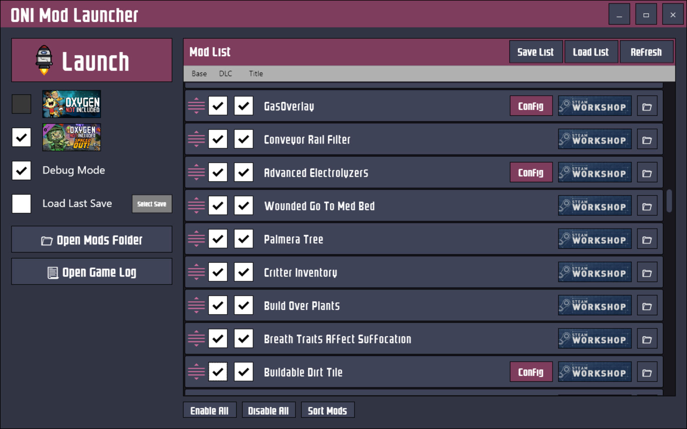

# ONI-ModLauncher
### A standalone mod manager and launcher for Oxygen Not Included.

## System Requirements
- 64-bit Windows
- .NET 5.0

## Features
- Organize your mod list outside of the game with the ability to save and load backups of your mod list.
- Toggle between Vanilla and DLC outside of the game.
- Enable Debug Mode with a simple checkbox.
- Enable a hidden testing feature that skips the main menu and immediately loads the last save file.
- Open and edit JSON config files for mods.
- Mod Sorting (For now this just sorts by steam ID with local/dev folder mods at the top)

## Upcoming Features
- Support for a "ModLauncher.json" file that allows mods to provide additional data for ONI Mod Launcher.
- Auto-detecting config files more intelligently
- Auto-updates from GitHub for non-Workshop mods.

## License
I have not decided on a license yet but you are free to download the source and compile for your own personal use.
Until I have chosen a license please do not redistribute this application in either source or binary form.
